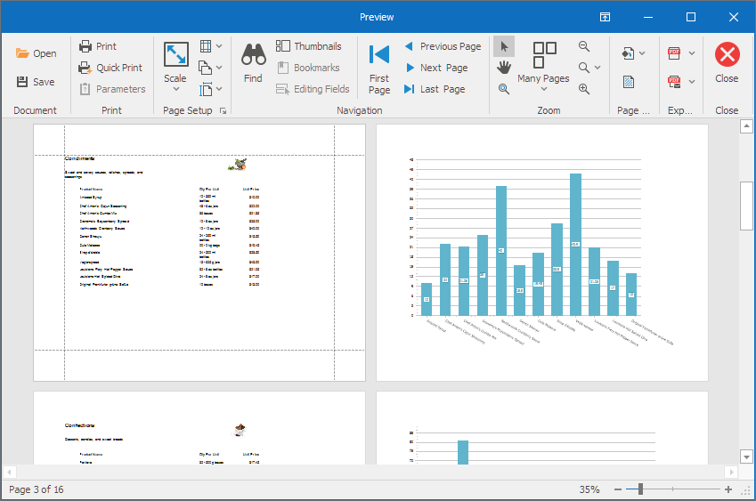

<!-- default badges list -->

<!-- default badges end -->
<!-- default file list -->
*Files to look at*:

* [Form1.cs](./CS/Reporting-Use-Subreport-To-Add-A-Chart/Form1.cs)
<!-- default file list end -->
# Use Subreports to Add a Chart

Review the guidelines aided in the creation of this example.

## Main Report

- The main report lists products grouped by category. 
- The [GroupHeader](https://docs.devexpress.com/XtraReports/DevExpress.XtraReports.UI.GroupHeaderBand) band displays the category name.
- The [GroupFields](https://docs.devexpress.com/XtraReports/DevExpress.XtraReports.UI.GroupHeaderBand.GroupFields) collection specifies the group field (the **CategoryID** field).
- The [Detail](https://docs.devexpress.com/XtraReports/DevExpress.XtraReports.UI.DetailBand) band lists products from the group field category.
- The [GroupFooter](https://docs.devexpress.com/XtraReports/DevExpress.XtraReports.UI.GroupFooterBand) band contains an [XRSubreport](https://docs.devexpress.com/XtraReports/DevExpress.XtraReports.UI.XRSubreport) control.
- The [XRSubreport](https://docs.devexpress.com/XtraReports/DevExpress.XtraReports.UI.XRSubreport)'s [ReportSource](https://docs.devexpress.com/XtraReports/DevExpress.XtraReports.UI.SubreportBase.ReportSource) property references a chart report.
- Add an item to the **XRSubreport**'s [ParameterBindings](https://docs.devexpress.com/XtraReports/DevExpress.XtraReports.UI.XRSubreport.ParameterBindings) collection to bind the chart report's **subreportCategory** parameter to the main report's group field (the **CategoryID** field).

## Chart Report

- The chart report visualizes products for a certain category.
- The chart report includes the [XRChart](https://docs.devexpress.com/XtraReports/DevExpress.XtraReports.UI.XRChart) control.
- Add an item to the chart's [Parameters](https://docs.devexpress.com/XtraReports/DevExpress.XtraReports.UI.XRChart.Parameters) collection to bind the **chartCategory** parameter to the report's **subreportCategory** parameter.
- The chart series' [FilterString](https://docs.devexpress.com/CoreLibraries/DevExpress.XtraCharts.SeriesBase.FilterString) property uses the **chartCategory** parameter value to filter data.

## Files to Review

- [Form1.cs](CS/Reporting-Use-Subreport-To-Add-A-Chart/Form1.cs) (VB: [Form1.vb](VB/Reporting-Use-Subreport-To-Add-A-Chart/Form1.vb))

## Documentation

- [Create a Report with a Subreport (Runtime Sample)](https://docs.devexpress.com/XtraReports/403396/detailed-guide-to-devexpress-reporting/reporting-api/create-reports-in-code/create-a-report-with-subreport)
- [XRSubreport Class](https://docs.devexpress.com/XtraReports/DevExpress.XtraReports.UI.XRSubreport)
- [Merge Reports: Use Data-Driven Page Sequence](https://docs.devexpress.com/XtraReports/400691)
- [Create a Report with Charts](https://docs.devexpress.com/XtraReports/401695/create-reports/create-a-report-with-charts)
- [Use Charts](https://docs.devexpress.com/XtraReports/15039/detailed-guide-to-devexpress-reporting/use-report-controls/use-charts)

## More Examples

- [How to implement a master-detail report using Subreports (XRSubreport) without parameter bindings](https://github.com/DevExpress-Examples/reporting-winforms-master-detail-subreport)
- [Reporting for WinForms - Use Binding Expressions to Highlight Average Product Prices in Charts](https://github.com/DevExpress-Examples/reporting-binding-expressions-in-charts)
- [WinForms End-User Designer - How to customize the Chart Wizard](https://github.com/DevExpress-Examples/Reporting_winforms-end-user-designer-how-to-customize-the-chart-wizard-t230406)
- [How to display a chart in a group footer (in a WinForms application)](https://github.com/DevExpress-Examples/Reporting_how-to-display-a-chart-in-a-group-footer-in-a-winforms-application-t228341)
